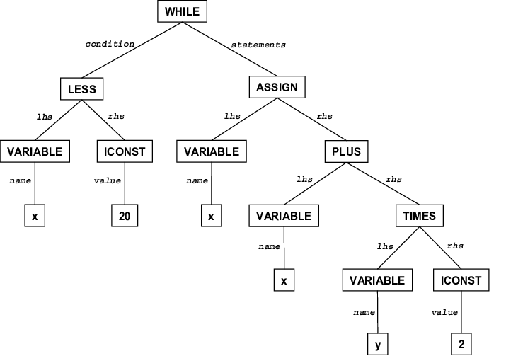

# MiniJava Semantic Analysis
<p align="center">
  
</p>
<br />Implementation of a Semantic Checker for a Compiler of MiniJava Language. MiniJava is a small subset of the Java language. First a JTB tool is used in order to create class hierarchies and visitor patterns that will be overwritten in order to write new visitors performing Static Checking.

## Language Specifications
Language Specifications can be viewed [here](minijava_specs.txt)
<br />Also the minijava grammar in BNF can be found [here](minijava_bnf.md)

## Deployment

The code was developed and tested on **Linux Ubuntu 18.04 LTS** using **openJDK and javac v11.0.4**.

## Prerequisites

A Linux distribution is required with a version of JDK and JRE. 
<br />You can check your jdk and jre version using:
<br />``` $ java -version ```
<br />``` $ javac -version ```

You can install the latest JDK and JRE version on Ubuntu based systems using:
<br />``` $ sudo apt install default-jre ```
<br />``` $ sudo apt install default-jdk ```

## Getting Started
Download Repository Locally using:
<br /> ```$ git clone https://github.com/AndCharalampous/minijava-semantic-check.git ```

## Compilation
Compile code using the Makefile provided:
<br /> ```$ cd src```
<br /> ```$ make```
<br /> Java main file is created.

### Execution
Execute using:
<br /> ```java Main [javaf1 javaf2 .. javafN]```
* Main: MiniJava Compiler Main file
* javaf#: MiniJava File that will be semantically checked
_At least one MiniJava file must be provided._

### Output
In stdout:
<br />--------------
<br />javaf1.java **
<br />--------------
<br />
<br />  -> Program Parsed Successfully.
<br />  -> Program Symanticly Checked.
<br />  -> Printing Class Offsets:
<br /> - Class Tree -
<br />      -- Variables --
<br />          Tree.left : 0
<br />          Tree.right : 8
<br />          ...
<br />      -- Methods --
<br />          Tree.Init : 0
<br />          Tree.SetRight : 8
<br />          Tree.SetLeft : 16
<br />          Tree.GetRight : 24
<br />          ...
<br />  ...


## Author
**Andreas Charalampous** - https://github.com/AndCharalampous

## License

This project is licensed under the MIT License - see the [LICENSE.md](LICENSE.md) file for details
